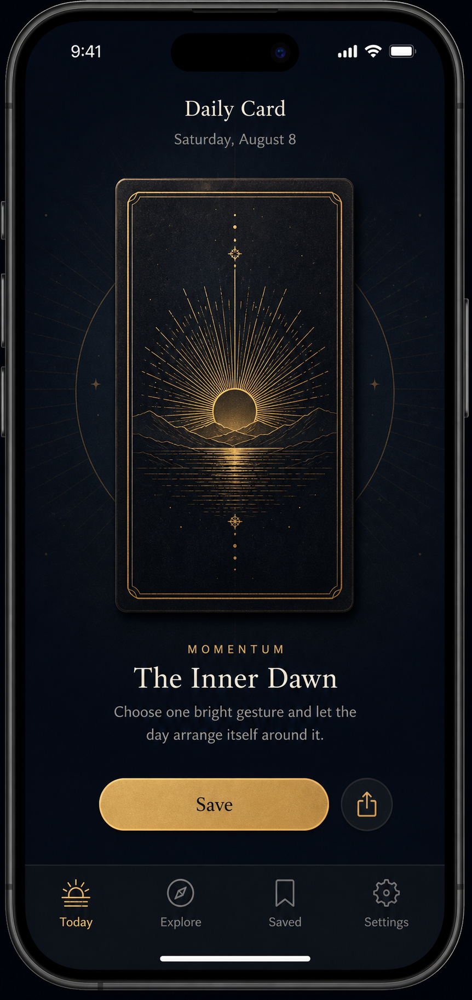
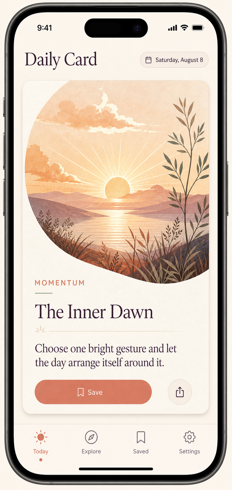
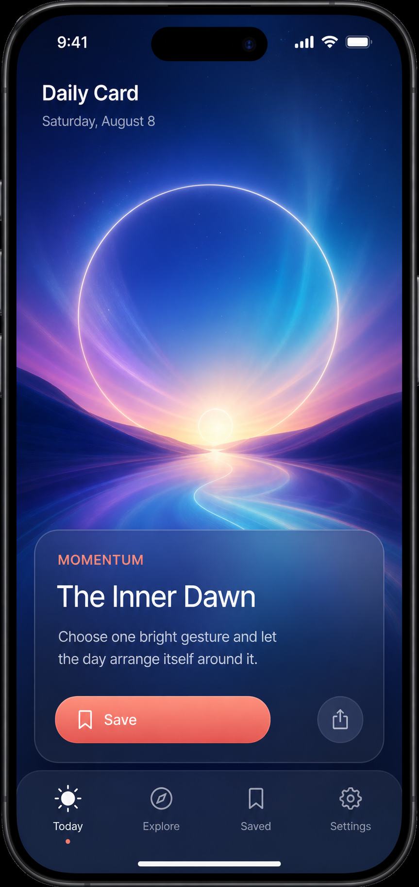
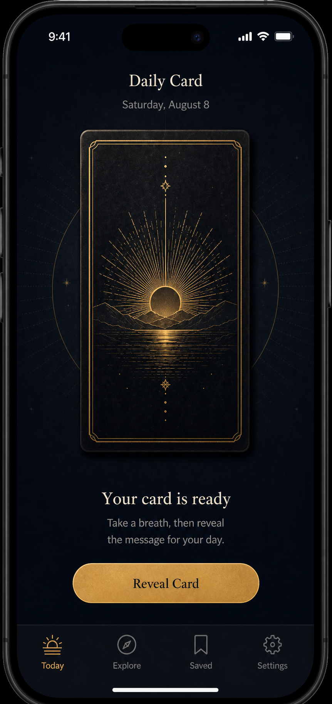

# Daily Tarot — iOS Visual Direction and Screen References

Updated: 2026-08-09

> Historical reference. Daily Tarot was superseded by the Tarot Deck product on 2026-08-09. Preserve this document and its images; use `design/TAROT_DECK_VISUAL_BRIEF.md` for current work. The Ceremonial Obsidian direction remains selected, but these Daily Tarot compositions do not approve any new screen.

## Product constraints

- Platform: iPhone/iOS only.
- Product language: English only.
- Approved implementation direction: native SwiftUI.
- No UI implementation is authorized from an image until that exact screen/state is explicitly approved.
- The previous Expo interface is conceptual reference only.

## Approved direction — A, Ceremonial Obsidian

- Screen and state: `Daily Card`, revealed.
- Relative path: `design/concepts/daily-card-a-ceremonial-obsidian.png`.
- Absolute reference: `C:\Users\dmkra\Documents\Codex Apps\TarotCotidianoNative\design\concepts\daily-card-a-ceremonial-obsidian.png`.
- Approval date: 2026-08-08.
- Status: **definitively approved; do not reopen this choice**.
- Requested changes: none.

Direction: a dark, tactile ritual built around a centered tarot object. Midnight navy, matte black paper, antique-gold line work, warm ivory type, and restrained celestial detailing provide a distinctive tarot identity without becoming theatrical.

Approved invariants:

- complete modern iPhone composition with credible safe areas, status bar, Dynamic Island, bottom navigation, and home indicator;
- centered tactile card as the dominant ritual object;
- midnight navy and matte black surfaces;
- antique-gold celestial line work and controls;
- warm ivory text with restrained hierarchy;
- English-only interface;
- four navigation destinations: `Today`, `Explore`, `Saved`, `Settings`.

Native and accessibility adaptations allowed: safe-area adjustments, Dynamic Type, VoiceOver labels, contrast corrections, minimum native tap targets, standard iOS symbols or materials, and Reduced Motion behavior, provided that hierarchy, spacing, palette, proportions, and ceremonial character remain faithful.

Approval boundary: this record applies only to the revealed `Daily Card` screen. Every other screen or materially different state requires its own visual reference and explicit approval.

## Preserved alternatives

### B — Dawn Journal

- Path: `C:\Users\dmkra\Documents\Codex Apps\TarotCotidianoNative\design\concepts\daily-card-b-dawn-journal.png`.
- Status: not approved; preserved as historical alternative.
- Direction: warm editorial journal with ivory paper, apricot and terracotta.

### C — Celestial Threshold

- Path: `C:\Users\dmkra\Documents\Codex Apps\TarotCotidianoNative\design\concepts\daily-card-c-celestial-threshold.png`.
- Status: not approved; preserved as historical alternative.
- Direction: immersive cobalt and violet celestial portal with translucent material.

B and C must not influence new references while A remains active.

## Historical approved state — Today, unrevealed

- Screen and state: `Today / Daily Card`, unrevealed.
- Relative path: `design/concepts/today-unrevealed-a-ceremonial-obsidian.png`.
- Absolute reference: `C:\Users\dmkra\Documents\Codex Apps\TarotCotidianoNative\design\concepts\today-unrevealed-a-ceremonial-obsidian.png`.
- SHA-256: `48B53E8A64857206771224D90155603944283DC829C0829161AD6EBE1BB209F9`.
- Dimensions: `862 × 1825`.
- Status: **approved historically on 2026-08-08; no longer an implementation target after the 2026-08-09 product change**.

Purpose and behavior:

- hide category, card title, message, question, save, and share until reveal;
- show one face-down obsidian card as the dominant object;
- let both the card and the explicit `Reveal Card` button perform the same action;
- preserve the approved A hierarchy, palette, materials, safe areas, and navigation;
- provide an explicit native-style button for clarity, VoiceOver, and a reliable touch target.

Exact visible English copy:

- `Daily Card`
- `Saturday, August 8`
- `Your card is ready`
- `Take a breath, then reveal the message for your day.`
- `Reveal Card`
- `Today`
- `Explore`
- `Saved`
- `Settings`

Visual QA:

- complete modern iPhone and safe areas visible;
- no content leaks before reveal;
- no Android or web conventions;
- no elements from B or C;
- practical SwiftUI-reproducible hierarchy;
- text is legible and English-only;
- Today is visibly active in the four-tab navigation.

## Generation record for the unrevealed candidate

- Mode: built-in ImageGen.
- Use case: `ui-mockup`.
- Reference: A — Ceremonial Obsidian as the approved direction; B and C explicitly excluded.
- Generated: 2026-08-08.

Final prompt summary:

> Create a complete high-fidelity native iOS `Today / Daily Card` unrevealed state in the approved Ceremonial Obsidian direction. Preserve the full iPhone frame, midnight navy interface, tactile matte-black card, antique-gold celestial detailing, warm ivory typography, safe areas and four-tab navigation. Center a face-down card, hide all card content, and show the exact English readiness copy with one gold `Reveal Card` button. Exclude all Dawn Journal, Celestial Threshold, Android, web, watermark, logo and extra-tab elements.

## Next step after approval

If the unrevealed candidate is approved:

1. record its approval date, requested changes, and accessibility allowances here and in `DECISIONS.md`;
2. continue automatically to the next required screen/state without waiting for another instruction;
3. do not implement it until the remaining implementation gates in `STATUS.md` are closed and one task owns implementation.
